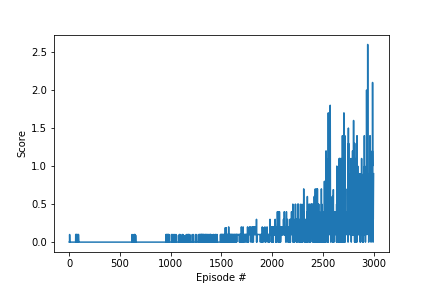

## Table of Contents
* [Learning Algorithm](#learning-algorithm)
* [Plot of Rewards](#plot-of-rewards)
* [Ideas for Future Work](#ideas-for-future-work)

## Learning Algorithm
The multi-agent version of DDPG algorithm was used to solve this project. This implementation is similar to the one proposed by [Lowe et al. 2018][1].

#### Algorithm advantages
- It can handle multi agent environments better than traditional reinforcement learning approaches
- The apparent non-stationarity of the environment from the point of view of individual agents is well handled by this algorithm

#### Algorithm steps
- Randomly initialize a "local" actor network (agent state mapped to agent action) and a "local" critic network (state and actions of all agents mapped to Q value) for each agent in the environment. Note that the critic network takes the "global" state information and actions by all agents as input. 
- Copy the weights of local actor and local critic network to a set of "target" actor and critic networks. 
- Initialize a replay buffer R
- For each episode do the following:
    - Initialize noise (OU process)
    - Obtain list of states s_{t} for all agents.
    - For each time step in an episode:
        - Choose list of actions a_{t} based on currect actor network and noise for all agents
        - Execute a_{t} and observe list of rewards r_{t} and new states s_{t+1} for all agents along with dones d_{t}
        - Store (s_{t}, a_{t}, r_{t}, d_{t}, s_{t+1}) in R
        - For each agent i
            - Sample a minibatch of N transitions from R
            - Optimize the local critic network parameters by
                - Calculating the mean squared error between 
                    - Estimated Q value from target critic network using Bellman equation. Actions a_{t+1} are obtained from target actor network of all agents using states s_{t+1}
                    - Q value from the local critic network. 
                - Minimize this error with respect to local critic network parameters of agent i
            - Optimize the local actor network parameters by
                - For all states s_{t} in the minibatch, find the noiseless action a'_{t} predicted by the local actor network of all agents and then compute the average Q value from the local critic network for all such state action pairs. Maximize the average Q value with respect to local actor network parameters of agent i
            - Update the target networks using soft update rule
         - s_{t} := s_{t+1}
         - Exit episode when d_{t} = True for any agent, or when maximum time steps reached

#### Model architecture
The actor network for each agent uses an input of size 24, corresponding to the state size observed by each agent. The output size for the actor network is 2. The critic network for each agent uses an input of size 48, corresponding to the combined states observed by the two agent. In addition it takes the actions of the two agents as input in the second layer of the network. This action input has a size of 4, corresponding to the combined actions of the two agents.

Model architecture and model hyperparameters as described in the DDPG paper [Lillicrap et al., 2016][2] were used in this project. Both the actor and critic networks had two fully connected hidden layers with linear transformation. The first layer size was set to 400 and the second layer size was set to 300 in both networks. In the case of critic network the input to second layer was composed of 400 dimensional output from first layer plus the 4 dimensional action input obtained from all agents. The rectilinear activation function is applied to the output of both hidden layers. The input states and output of first hidden layer where subjected to batch normalization in both networks.

The final output layer of the actor was a 2 dimensional "tanh" layer to bound the actions and the final output layer of the critic was a 1 dimensional ReLU output representing the value of Q function.

The weights and biases of the hidden layers and output layers were initialized as described in the paper [Lillicrap et al., 2016][2].

#### Algorithm hyperparameters

* BUFFER_SIZE = int(1e6)  # replay buffer size
* BATCH_SIZE = 128        # minibatch size
* GAMMA = 0.99            # discount factor
* TAU = 1e-3              # for soft update of target parameters
* LR_ACTOR = 1e-4         # learning rate of the actor 
* LR_CRITIC = 1e-3        # learning rate of the critic
* WEIGHT_DECAY = 0        # L2 weight decay

OU process was used with theta = 0.15 and sigma = 0.2 
All the hyperparameters are as described in the [paper][2] except for BATCH_SIZE which was increased from 64 to 128 and WEIGHT_DECAY which was reduced from 1e-2 to 0. These changes helped improve the speed of learning.

DDPG implementation from the lessons was modified to solve this problem. The max_t variable in the ddpg function was increased to 1000. 

The OU process was also modified. The implementation to use np.random.randn() instead of random.random(), since randn() gives normally distributed samples whereas random() gives uniformly distributed samples between 0 and 1.

We noticed that performing actor and critic network updates multiple times at a time step is helpful in stabilizing the algorithm. We also noticed that adding a gap of a few time steps between these multiple updates helped speed up the algorithm.

In our approach we are doing 3 updates at a gap of 4 time steps.

## Plot of Rewards
The model was able to solve the task in 2998 episodes in the Udacity workspace with GPU environment enabled in around 50 minutes. Here is a plot of rewards for the agents trained in GPU mode.

Environment solved in 2998 episodes!          Average Score: 0.505

## Ideas for Future Work

- Try changing the hyperparameters using grid search to increase the speed of learning in the algorithm
- Consider implementing other new approaches to solve this environment such as described [here][4]
- We noticed that one agent learnt for a long time before the other agent started learning. We could try taking inputs from the benchmark implementation such as training through self play, using a single actor network for both agents and employing a shared replay buffer.  
- Seed to the algorithm can also have an impact on learning as described [here][3]. We should try different seeds to the problem. This would ensure our hyperparameters are robust enough to handle different initializations. 

[1]: https://arxiv.org/pdf/1706.02275.pdf
[2]: https://arxiv.org/pdf/1509.02971.pdf
[3]: https://www.alexirpan.com/2018/02/14/rl-hard.html
[4]: https://arxiv.org/pdf/1802.05438.pdf
